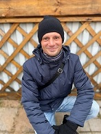

# Демиденко Юрий Сергеевич

Всем привет! Это моё резюме, в котором я кратко расскажу о себе. Имею два высших образования, основное образование - техническое в области *telecommunications*. Дополнительное высшее образование - *экономическое*. Почти 10 лет я работал инженером в службе связи, занимался обслуживанием телекоммуникационного оборудования, участвовал в запуске и наладке больших telecom-проектов. Мои интересы: компьютеры, IT, программирование. В настоящий момент учусь на курсе *iOS-разработчик*, изучаю язык **Swift**, который мне очень нравится.
## Мои навыки и умения
*  Способность самостоятельно разобраться в новой для меня задаче
* Умение найти нужную информацию
* Способность к командной работе
* Нацеленность на результат
* Ответственность
* Внимательность